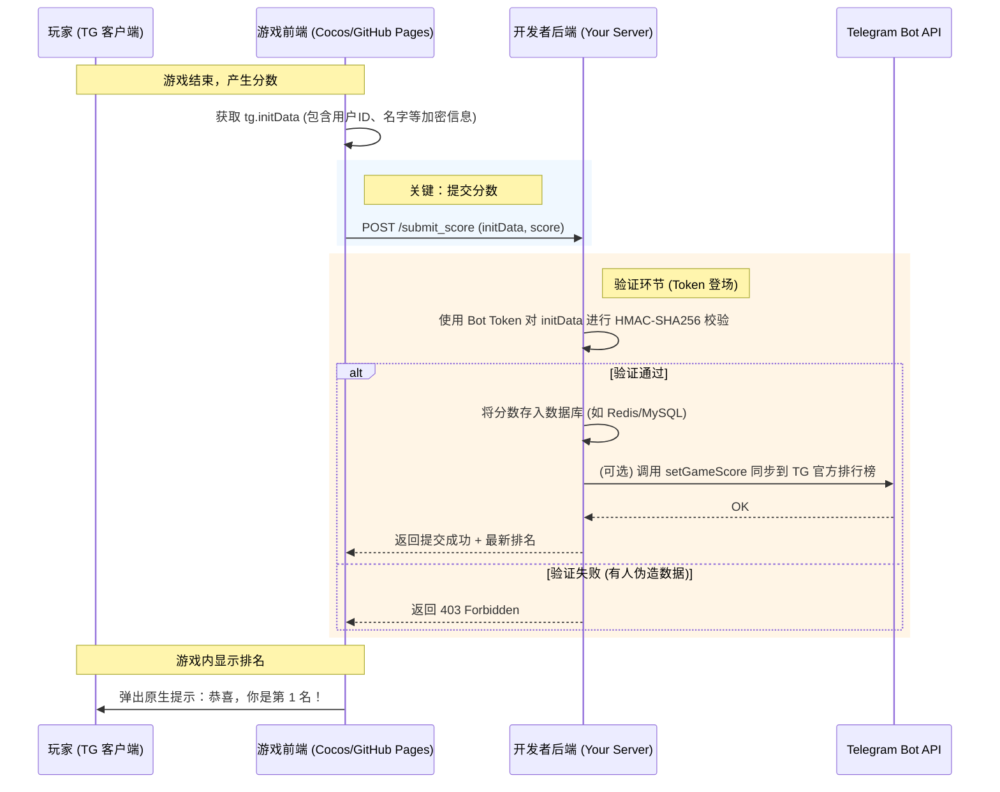

# tg game token usage

```mermaid

sequenceDiagram
    participant Player as 玩家 (TG 客户端)
    participant Game as 游戏前端 (Cocos/GitHub Pages)
    participant Server as 开发者后端 (Your Server)
    participant TG_API as Telegram Bot API

    Note over Player, Game: 游戏结束，产生分数
    Game->>Game: 获取 tg.initData (包含用户ID、名字等加密信息)
    
    rect rgb(240, 248, 255)
    Note right of Game: 关键：提交分数
    Game->>Server: POST /submit_score (initData, score)
    end

    rect rgb(255, 245, 230)
    Note right of Server: 验证环节 (Token 登场)
    Server->>Server: 使用 Bot Token 对 initData 进行 HMAC-SHA256 校验
    alt 验证通过
        Server->>Server: 将分数存入数据库 (如 Redis/MySQL)
        Server->>TG_API: (可选) 调用 setGameScore 同步到 TG 官方排行榜
        TG_API-->>Server: OK
        Server-->>Game: 返回提交成功 + 最新排名
    else 验证失败 (有人伪造数据)
        Server-->>Game: 返回 403 Forbidden
    end
    end

    Note over Game, Player: 游戏内显示排名
    Game->>Player: 弹出原生提示：恭喜，你是第 1 名！

```
